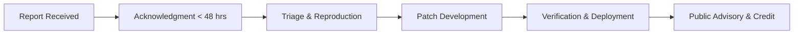

# Security Policy — Hackathon Notifier

The **Hackathon Notifier** team and maintainers take the security of this project, our services, and user data seriously. We appreciate the efforts of security researchers and community members who help keep our ecosystem secure through responsible vulnerability disclosure.

---

## Supported Versions

Only the current production deployment and the latest code on the `main` branch receive active security updates and patches.

| Component | Target / Environment | Supported |
| :--- | :--- | :---: |
| **`main` branch** | Latest source repository code | :white_check_mark: |
| **Frontend (Production)** | [hackathon-notifier.vercel.app](https://hackathon-notifier.vercel.app) | :white_check_mark: |
| **Backend (Production)** | [hackathon-notifier.onrender.com](https://hackathon-notifier.onrender.com) | :white_check_mark: |
| **Older releases / commits** | Any detached commit or fork | :x: |

---

## Reporting a Vulnerability

If you discover a security vulnerability or sensitive flaw within Hackathon Notifier, **please do NOT open a public GitHub issue or discuss it publicly.** Public disclosure prior to remediation puts users and deployments at risk.

### Preferred Method: GitHub Private Vulnerability Reporting

1. Navigate to the repository's **[Security tab](https://github.com/Pranavdeshmukhhh/hackathon-notifier/security)**.
2. Under "Security", click on **"Advisories"** and then **"Report a vulnerability"** (or click [here](https://github.com/Pranavdeshmukhhh/hackathon-notifier/security/advisories/new)).
3. Provide full details in the advisory form. This opens a private, encrypted discussion with the maintainers.

### Alternative Contact

If Private Vulnerability Reporting is unavailable:
- Open a discussion with the tag `[SECURITY]` or contact the maintainer directly via GitHub profile: [@Pranavdeshmukhhh](https://github.com/Pranavdeshmukhhh).

---

## What to Include in Your Report

To help us investigate, triage, and address the issue as quickly as possible, please provide:

1. **Vulnerability Type**: (e.g., XSS, SSRF, Broken Authentication, Information Disclosure, Denial of Service, Insecure Direct Object References).
2. **Component Affected**:
   - Frontend (`/Frontend` or https://hackathon-notifier.vercel.app)
   - Backend API (`/Backend` or https://hackathon-notifier.onrender.com)
   - Scrapers / Background Worker
   - CI/CD Pipelines / Deployment Configuration
3. **Step-by-Step Reproduction**:
   - Detailed instructions or a minimal Proof of Concept (PoC) script/request.
4. **Estimated Impact**:
   - What could an attacker achieve if exploiting this vulnerability?
5. **Suggested Fix / Remediation** (optional, but greatly appreciated).

---

## Response & Disclosure Process

When a security vulnerability is reported, we follow this coordinated disclosure process:

1. **Acknowledgment**: We acknowledge receipt of your report within **48 hours**.
2. **Investigation & Triage**: We assess the severity, reproduce the behavior, and determine the blast radius within **3–5 business days**.
3. **Remediation & Patching**: We develop and test a fix in a private branch.
4. **Deployment**: The fix is deployed immediately to production environments (Vercel and Render).
5. **Coordinated Disclosure**: Once patched, a public security advisory will be published and credit will be given to the reporter (unless you request anonymity).

---

## Security Architecture & Defenses

Hackathon Notifier implements multiple layers of defense:

### 1. Secret & Credential Management
- **Zero hardcoded secrets**: All API keys, database connection strings (`MONGO_URI`), and Telegram bot credentials are strictly loaded via environment variables (`.env`).
- Environment configuration files (`.env`, `.env.local`, `*.pem`) are strictly excluded from git tracking via comprehensive `.gitignore` rules.
- Production credentials reside exclusively in Vercel and Render encrypted environment stores.

### 2. HTTP Security Headers
The frontend application serves hardened HTTP response headers (defined in `Frontend/vercel.json`):
- `Content-Security-Policy`: Restricts scripts, styles, fonts, and network connections to authorized origins (FastAPI backend, OpenStreetMap tiles, Nominatim geocoding, Google Fonts).
- `X-Frame-Options: DENY`: Protects against clickjacking attacks.
- `X-Content-Type-Options: nosniff`: Prevents MIME-type sniffing vulnerabilities.
- `Referrer-Policy: strict-origin-when-cross-origin`: Controls referrer data leakage across cross-origin requests.
- `Strict-Transport-Security (HSTS)`: Forces secure HTTPS connections (`max-age=63072000; includeSubDomains; preload`).
- `Permissions-Policy`: Disables unneeded browser hardware capabilities (camera, microphone, payment, USB).

### 3. API & Backend Defenses
- **CORS Restrictions**: Cross-Origin Resource Sharing is controlled in `unified_server.py` to allow legitimate frontend clients.
- **Request Rate Limiting**: Anti-abuse throttling protects scrapers, health checks, and data queries from Denial of Service (DoS).
- **Input Validation**: All query parameters, sorting arguments, and incoming payloads are strictly validated using Pydantic models.
- **Scraping Ethics & Safety**: Scrapers employ polite delays, headers, user-agent identification, and backoff handling to prevent overloading external platforms.

### 4. Data Privacy
- Hackathon Notifier does not store personal identifiable information (PII) or passwords.
- Geolocation preferences are queried client-side solely for distance calculation and relevance filtering.

---

## Security Guidelines for Contributors & Self-Hosters

If you are cloning, contributing to, or hosting your own instance of Hackathon Notifier:

- :warning: **Never commit a `.env` file**: Always use `.env.example` as a template.
- :key: **Rotate credentials**: If you suspect a bot token, database password, or API key was exposed, revoke and regenerate it immediately.
- :lock: **MongoDB Network Access**: Whitelist only required IP addresses in MongoDB Atlas Network Access rather than opening unrestricted access (`0.0.0.0/0`) if feasible.
- :shield: **Keep dependencies updated**: Regularly run `npm audit` in `Frontend` and review `Backend/requirements.txt` for patched packages.

---

*Thank you for helping keep Hackathon Notifier and the developer community secure!*
