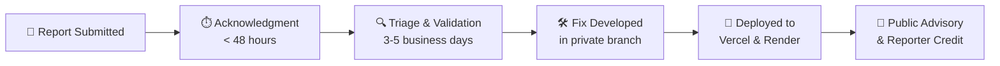

# 🛡️ Security Policy — Hackathon Notifier

Welcome to the **Hackathon Notifier** security policy. We take the safety and integrity of this project, our services, and community data seriously.

If you believe you have discovered a security vulnerability, we appreciate your help in disclosing it to us responsibly.

---

## ⚡ Quick Reference

| Item | Details |
| :--- | :--- |
| **Primary Reporting Channel** | [GitHub Private Vulnerability Reporting](https://github.com/Pranavdeshmukhhh/hackathon-notifier/security/advisories/new) |
| **Initial Acknowledgment** | Within **48 hours** |
| **Triage & Assessment** | Within **3–5 business days** |
| **Supported Branches** | `main` branch (latest commit) |
| **Live Deployments** | [hackathon-notifier.vercel.app](https://hackathon-notifier.vercel.app) & [hackathon-notifier.onrender.com](https://hackathon-notifier.onrender.com) |
| **Public Issues for Security?** | ❌ **No.** Please do not open public issues for security vulnerabilities. |

---

## 📦 Supported Versions

We actively provide security patches and updates for the following components:

| Component | Target / Environment | Status |
| :--- | :--- | :---: |
| **`main` branch** | Latest repository source code | ✅ Supported |
| **Frontend Web App** | [hackathon-notifier.vercel.app](https://hackathon-notifier.vercel.app) (Vercel) | ✅ Supported |
| **Backend API** | [hackathon-notifier.onrender.com](https://hackathon-notifier.onrender.com) (Render) | ✅ Supported |
| **Forked / Outdated branches** | Any detached commit or unmerged fork | ❌ Not Supported |

---

## 🚨 How to Report a Vulnerability

> [!IMPORTANT]
> **Please DO NOT report security vulnerabilities via public GitHub issues, pull requests, discussions, or social media.**  
> Disclosing an unpatched vulnerability publicly puts users and live deployments at risk.

### Method 1: GitHub Private Vulnerability Reporting (Recommended)

GitHub provides a built-in, confidential channel to report security issues directly to repository maintainers:

1. Go to the repository's **[Security Tab](https://github.com/Pranavdeshmukhhh/hackathon-notifier/security)**.
2. Select **Advisories** on the left sidebar.
3. Click the green **[Report a vulnerability](https://github.com/Pranavdeshmukhhh/hackathon-notifier/security/advisories/new)** button.
4. Fill out the advisory form with details and submit. This creates an encrypted, private discussion accessible only to you and the project maintainers.

### Method 2: Direct Maintainer Contact

If you cannot access the GitHub Advisories interface:
- Reach out privately via GitHub profile: [@Pranavdeshmukhhh](https://github.com/Pranavdeshmukhhh).

---

## 📝 What to Include in Your Report

To help us investigate, triage, and resolve the issue quickly, please include:

1. **Summary**: A clear, concise overview of what the vulnerability is.
2. **Impact**: What could an attacker potentially do? (e.g., bypass rate limits, access internal endpoints, inject malicious code).
3. **Affected Component**:
   - Frontend (`Frontend/` or https://hackathon-notifier.vercel.app)
   - Backend API (`Backend/` or https://hackathon-notifier.onrender.com)
   - Scrapers (`Backend/scrapers/`)
   - CI/CD & Deployments (`.github/workflows/`, `vercel.json`)
4. **Steps to Reproduce**: Step-by-step instructions, a cURL command, or minimal code snippet showing how to trigger the issue.
5. **Suggested Fix**: (Optional) If you have identified how to fix or mitigate the issue, let us know!

---

## ⏱️ What to Expect After Reporting

We follow a **Coordinated Vulnerability Disclosure** workflow:

1. **Prompt Acknowledgment**: You will receive a response within **48 hours** confirming that we received your report.
2. **Active Investigation**: We reproduce the issue and evaluate the severity within **3–5 business days**.
3. **Private Remediation**: We write and verify a patch in a private security branch without leaking details.
4. **Immediate Deployment**: The fix is deployed straight to production on Vercel and Render.
5. **Credit & Recognition**: After the patch is live, we publish a security advisory and credit you for your responsible disclosure (unless you prefer to remain anonymous).

---

## 🛡️ Built-in Security Measures

Here is a plain-English explanation of how Hackathon Notifier protects users and services:

### 1. Zero Leaked Credentials
- **No secrets in git**: API keys, database connection strings (`MONGO_URI`), and Telegram bot tokens are strictly loaded via `.env`.
- Files containing credentials (`.env`, `.env.local`, `.pem`) are blocked by `.gitignore`.
- Production secrets are stored securely in Vercel and Render encrypted environment stores.

### 2. Frontend Hardening (`Frontend/vercel.json`)
- **Content Security Policy (CSP)**: Ensures the browser only loads scripts, styles, fonts, and API requests from trusted, whitelisted origins.
- **Clickjacking Protection (`X-Frame-Options: DENY`)**: Prevents other websites from embedding our web app inside hidden iframes.
- **MIME Sniffing Block (`X-Content-Type-Options: nosniff`)**: Forces browsers to strictly adhere to declared content types.
- **HSTS (Strict-Transport-Security)**: Automatically upgrades all incoming web connections to secure HTTPS.
- **Permissions Policy**: Completely turns off unnecessary browser hardware access (camera, microphone, payments, USB).

### 3. Backend & API Defense (`Backend/unified_server.py`)
- **Rate Limiting**: Uses SlowAPI to prevent bots or scrapers from spamming our endpoints or overwhelming Render.
- **Constant-Time Admin Authentication**: Admin actions require an `ADMIN_SECRET` checked via `secrets.compare_digest` to prevent timing attacks.
- **Strict Payload Validation**: All API inputs and filter queries are validated with Pydantic schemas to reject malformed requests.
- **Polite Scraping**: Web scrapers include random delays, rotating user-agents, and backoff logic to prevent overwhelming upstream hackathon sites.

### 4. User Privacy First
- **No Accounts Required**: No passwords, usernames, or sensitive personal data are ever stored in our database.
- **Minimal Telegram Data**: We only store user chat IDs to send opt-in hackathon alerts.
- **Private Geolocation**: Location queries for "Nearest Hackathons" happen purely in your browser for distance calculations — your coordinates are never saved to a database.

---

## 🔒 Best Practices for Contributors & Self-Hosters

If you run or contribute to this codebase locally:

- 🛑 **Never push `.env` files** to GitHub. Always use `.env.example` as a clean template.
- 🔄 **Rotate exposed keys immediately**: If you accidentally expose a Telegram token or MongoDB connection URI, revoke and regenerate it immediately.
- 🛡️ **Restrict MongoDB Atlas Network Access**: Limit database access to specific IP ranges or your Render outbound IPs instead of leaving `0.0.0.0/0` open permanently.
- 📦 **Keep dependencies clean**: Regularly run `npm audit` in `Frontend/` and update packages in `Backend/requirements.txt`.

---

  Maintained by <strong><a href="https://github.com/Pranavdeshmukhhh">Pranav Deshmukh</a></strong> 
  Thank you for helping keep Hackathon Notifier safe for everyone!

